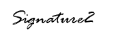

---
output:
  word_document:
    reference_docx: "progress reports template.docx"
    keep_md: true
---

<br>

IS/JAC/[INSERT NUMBER]
<div>`r format(Sys.Date(), "%d %B %Y")`</div>

<br>

<center>

Circular Communication to Commissioners, Contracting Governments and Members of the Scientific Committee

<br>

IWC.ALL.[INSERT NUMBER]  
c.c. Accredited observers to the IWC

<br>

**Submission of Scientific Progress Reports**

</center>

<br>

Each IWC member nation is urged by the Commission to provide a national Scientific Progress Report following guidelines agreed by the Commission.Unfortunately, a very limited number of IWC member countries have submitted Scientific Progress Reports in recent years – less than 15 reports per year. The Scientific Committee has repeatedly stressed that a higher submission rate will enhance the information available to it and therefore the quality of the advice presented to the Commission. 

<br>

Scientific Progress Reports have their origin in Article VIII, Paragraph 3 of the Convention and are formalised in the Rules of Procedure of the Scientific Committee (SC) (Rule E.1). They make a vital contribution to the work of the SC and the Commission. They also provide a valuable opportunity for countries to share an overview of their national cetacean research and data to the IWC community, and as such stimulate important cross-country collaboration in science and conservation actions.

<br>

Scientific Progress Reports are intended to provide a concise summary of the cetacean research undertaken in member countries as well as a summary of information on direct and incidental anthropogenic mortality, by calendar year. The goal is to provide an overview rather than detailed data from each country. For example, bycatch data are presented as a summary of the total bycatch estimated by species and area rather than detailing each bycatch incident. The reports also provide information on where the detailed information can be obtained. Countries with newly established or developing data programmes are encouraged to submit whatever data are available as even partial reports are useful. If countries also wish to submit their detailed data, this should be sent to statistics@iwc.int.

<br>

In response to requests from national delegations, an online submission system has been developed for ease of submission. The instructions have recently been enhanced to facilitate and thereby encourage submissions.

<br>

National representatives wishing to submit data and who are using the database portal for the first time will need to register online and then contact it.support@iwc.int for further instructions.

<br>

Secretariat staff are available to assist with submitting data and can provide a bulk upload service if required. Please contact it.support@iwc.int in the first instance if assistance is required.

<br>

Although Scientific Progress Reports can be submitted at any time via the portal, submission of data before the **`r format(Sys.Date()+30, "%d %B %Y")`** is encouraged, to facilitate the timely analysis of annually submitted data by the Secretariat.

<br>

<center>




**NAME**

Head of Science, Conservation and Management
<br>

</center>

```{r, results='asis', echo = F}
cat("\n\n<style> body { font-family: 'Times New Roman'; } h1, h2, h3, h4 { text-align: center; } p { text-align: justify; } </style>\n")
```
